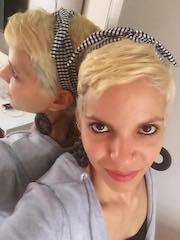

 
Sou canceriana, do dia de São João. Casada e mãe de três. Amante das letras, das palavras, dos textos. Nasci em Taguatinga/DF, morei seis anos em João Pessoa/PB e atualmente estou em Amsterdã, na Holanda.  

Concluí minha graduação em Letras com habilitação em Língua Portuguesa e Respectiva Literatura (licenciatura e bacharelado), pela Universidade de Brasília (UnB), em 2010. Cursei uma especialização a distância em Língua Portuguesa, pelo Centro Universitário Barão de Mauá, em 2012, já em João Pessoa. E defendi meu mestrado em Linguística Aplicada (faça o _download_ da minha dissertação [aqui](https://sigaa.ufpb.br/sigaa/verProducao?idProducao=678570&key=ec6d5d7a66fa0c735f1d27438e403fc5)), pelo Programa de Pós-Graduação em Linguística da Universidade Federal da Paraíba (Proling-UFPB), em 2017.

Meu primeiro contato com revisão de textos foi no final da minha graduação, quando estudei o assunto brevemente em uma disciplina do curso. Ainda na mesma época, fiz estágio no Superior Tribunal Federal. Foi quando me apaixonei por revisão! <3

De 2012 a 2018, fui revisora de textos da Diretoria de Educação a Distância do Instituto Federal de Educação, Ciência e Tecnologia da Paraíba (DEAD-IFPB), trabalhando diretamente com a produção de material didático de cursos na modalidade a distância e com a revisão de textos diversos. Na Diretoria, também coordenei o Programa de Qualificação Profissional em Revisão de Textos, voltado para qualificar os estudantes do curso de Letras a distância do Instituto para trabalharem profissionalmente na área de revisão de textos.

No período entre 2012 e 2016, fiz parte da equipe de avaliadores do Centro de Seleção e de Promoção de Eventos (CESPE) e do Instituto Nacional de Estudos e Pesquisas Educacionais Anísio Teixeira (INEP), trabalhando na correção de redações de candidatos para concursos públicos e para o Exame Nacional do Ensino Médio (ENEM).

Assim, desde 2010 eu trabalho com a revisão linguístico-discursiva de um vasto leque de gêneros textuais, tais como: trabalhos acadêmicos (monografias, dissertações, teses, artigos), livros, e-books, materiais didáticos, documentos oficiais, manuais, material publicitário (_folders_, folhetos, _banners_), publicações _on-line_, entre outros. E vasto também é o público a que atendo, cuja maioria se compõe de estudantes universitários.

Resolvi criar o [SANTA REVISÃO](/) para “salvar” as pessoas que precisam de ajuda com a nossa língua portuguesa, principalmente quando materializada na forma de texto.
